# GitHub Copilot CLI Integration for Automated Test Fixing

This directory contains the implementation of automated Playwright test failure investigation and fixing using GitHub Copilot CLI.

## 📁 What's Inside

```
.github/
├── agents/
│   └── test-fixer.md              # Custom Copilot agent for test fixing
├── workflows/
│   └── copilot-test-fixer.yml     # GitHub Actions workflow
├── scripts/
│   └── run-copilot-investigation.sh # Helper script for local/CI testing
└── docs/
    ├── copilot-cli-setup.md        # Setup and configuration guide
    └── copilot-cli-testing-guide.md # POC testing instructions
```

## 🚀 Quick Start

### 1. Configure Secrets

Set these repository secrets:

```bash
gh secret set COPILOT_CLI_TOKEN --body "ghp_your_copilot_token"
gh secret set JIRA_API_TOKEN --body "your_jira_token"
gh secret set JIRA_USER_EMAIL --body "your-email@example.com"
```

See [copilot-cli-setup.md](docs/copilot-cli-setup.md) for detailed instructions.

### 2. Test the Workflow

Follow the [testing guide](docs/copilot-cli-testing-guide.md) to run the POC:

1. Change "Organisation" to "Org" in UI
2. Push to trigger Playwright test failure
3. Watch Copilot CLI automatically:
   - Analyze the failure
   - Fix the test code
   - Create Jira ticket
   - Create GitHub issue
   - Generate fix PR
4. Review and approve the PR

## 🎯 What It Does

**When Playwright tests fail**, the workflow:

1. ✅ **Detects failure** - Triggers automatically via `workflow_run`
2. ✅ **Downloads artifacts** - Gets test results, screenshots, logs
3. ✅ **Analyzes root cause** - Uses Copilot CLI with custom agent
4. ✅ **Fixes test code** - Updates expectations, selectors, page objects
5. ✅ **Creates Jira ticket** - Sub-task under GHC-1392 with full details
6. ✅ **Creates GitHub issue** - Links to Jira, includes failure context
7. ✅ **Generates PR** - Delegates to Copilot coding agent for fix
8. ✅ **Awaits human approval** - You review and merge

**Result:** 15+ minutes of manual work → Fully automated ⚡

## 📋 Prerequisites

- GitHub Copilot Enterprise subscription
- Copilot CLI enabled in organization
- Atlassian (Jira) account for issue tracking
- GitHub PAT with `copilot`, `repo`, `workflow` scopes

## 🔧 Components

### Custom Agent: `test-fixer.md`

Specialized Copilot agent that:
- Understands Playwright test patterns
- Analyzes test failures vs UI changes
- Fixes test code (not application code)
- Follows project conventions
- Creates Jira tickets and GitHub issues

**Key features:**
- Role-based locator fixes
- TypeScript-aware (no `any` types)
- Respects project instructions
- Links everything (Jira ↔ GitHub ↔ PR)

### Workflow: `copilot-test-fixer.yml`

GitHub Actions workflow that:
- Triggers on Playwright test failures
- Installs and configures Copilot CLI
- Sets up Atlassian MCP server
- Runs investigation with test-fixer agent
- Posts results as commit comments

**Workflow steps:**
1. Checkout code (with history)
2. Install Node.js and dependencies
3. Install Copilot CLI
4. Download test artifacts
5. Extract failure details
6. Configure MCP servers
7. Run Copilot agent
8. Upload investigation logs
9. Comment on commit

### Helper Script: `run-copilot-investigation.sh`

Bash script for:
- Local testing of agent
- Manual investigations
- CI/CD debugging

**Usage:**
```bash
export COPILOT_CLI_TOKEN="your-token"
export JIRA_API_TOKEN="your-jira-token"
export JIRA_USER_EMAIL="your@email.com"

./.github/scripts/run-copilot-investigation.sh \
  "https://github.com/org/repo/actions/runs/123" \
  "test-name-that-failed" \
  "branch-name" \
  "commit-sha"
```

## 🧪 POC Test Scenario

**Scenario:** Change "Organisation" to "Org" in UI

**Expected flow:**
1. Developer pushes UI change
2. Playwright test fails (expects "Organisation")
3. Copilot detects failure within 1 minute
4. Copilot analyzes: "UI text changed"
5. Copilot fixes test expectation
6. Jira ticket created: GHC-XXXX
7. GitHub issue created: #YYY
8. PR created: #ZZZ
9. Human reviews and approves
10. Tests pass ✅

**Time saved:** ~15-20 minutes per failure

## 📊 Architecture

```mermaid
graph TB
    A[Developer Push] --> B[Playwright Tests Run]
    B --> C{Tests Pass?}
    C -->|No| D[Copilot Test Fixer Triggers]
    C -->|Yes| E[Done ✅]
    D --> F[Download Artifacts]
    F --> G[Copilot CLI Analyzes]
    G --> H[Fix Test Code]
    H --> I[Create Jira Ticket]
    I --> J[Create GitHub Issue]
    J --> K[Generate Fix PR]
    K --> L[Human Reviews]
    L --> M{Approve?}
    M -->|Yes| N[Merge PR]
    M -->|No| O[Manual Fix]
    N --> E
```



## 🔒 Security

- All credentials stored in GitHub Secrets
- Tokens scoped to minimum required permissions
- MCP server configured per-run (not persisted)
- Repository directory trusted per-session
- Human approval required for all PRs

## 💰 Cost Considerations

**GitHub Actions:**
- ~5-10 minutes per investigation
- Standard runner pricing

**Copilot API:**
- ~5,000-20,000 tokens per investigation
- Premium Copilot request usage
- Monitor in organization Copilot settings

**Recommendation:** Start with POC on limited branches, scale after validation.

## 🎯 Success Criteria

POC is successful when:
- ✅ Workflow triggers automatically on test failure
- ✅ Root cause identified correctly (UI change)
- ✅ Test fix is accurate and follows conventions
- ✅ Jira ticket created with full context
- ✅ GitHub issue linked properly
- ✅ PR generated and tests pass
- ✅ Total automation time < 10 minutes
- ✅ Human only reviews, doesn't investigate

## 📈 Future Enhancements

After successful POC:

1. **Expand coverage:**
   - Selector changes
   - Timing issues
   - Breaking changes
   - API failures

2. **Add intelligence:**
   - Confidence scoring
   - Auto-merge for high-confidence fixes
   - Learning from past fixes

3. **Integrate more:**
   - Slack/Teams notifications
   - Metrics dashboard
   - Multiple Jira projects
   - Custom approval rules

4. **Scale:**
   - Run on all branches
   - Support multiple test frameworks
   - Add rollback mechanism
   - Implement fix rate tracking

## 📚 Documentation

- **[Setup Guide](docs/copilot-cli-setup.md)** - Configure secrets and environment
- **[Testing Guide](docs/copilot-cli-testing-guide.md)** - Run the POC end-to-end
- **[Custom Agent](agents/test-fixer.md)** - Agent behavior and decision logic
- **[Workflow](workflows/copilot-test-fixer.yml)** - CI/CD automation details

## 🆘 Support

**Issues:** File with label `copilot-cli`

**External Resources:**
- [GitHub Copilot CLI Docs](https://docs.github.com/en/copilot/how-tos/use-copilot-agents/use-copilot-cli)
- [Atlassian MCP Server](https://github.com/janhq/mcp-server-atlassian)
- [Creating Custom Agents](https://docs.github.com/en/copilot/how-tos/use-copilot-agents/coding-agent/create-custom-agents)

## ✅ Next Steps

1. **Configure secrets** - See setup guide
2. **Review agent definition** - Customize if needed
3. **Test locally** - Run script with sample failure
4. **Run POC** - Follow testing guide
5. **Evaluate results** - Review accuracy and time savings
6. **Iterate** - Improve agent based on learnings
7. **Scale** - Roll out to more scenarios

---

**Ready to get started?** Begin with [copilot-cli-setup.md](docs/copilot-cli-setup.md)!
